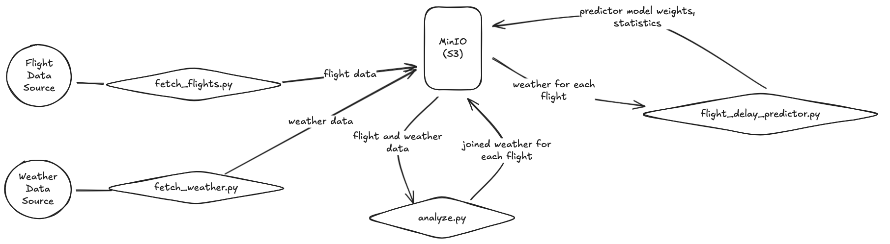

# flight-delays

The goal of this project is to build a data pipeline to analyze flight delays
in relation to weather patterns.

## Getting the Data

To fetch the flight delay data, run the following:

```shell
mkdir data
curl -L -o data/flight-delay-dataset-2018-2024.zip\
  https://www.kaggle.com/api/v1/datasets/download/shubhamsingh42/flight-delay-dataset-2018-2024
unzip data/flight-delay-dataset-2018-2024.zip -d data
```

To fetch the weather data (hourly weather patterns for each airport location), run:

```shell
uv run fetch-weather.py
```

This can take a long time to execute.

## Storage

This project uses MinIO for S3-compatible object storage.

```shell
# Start MinIO
docker-compose up -d

# Initialize storage structure
uv run storage.py

# Upload fetched local data to MinIO
uv run upload_data.py
```

MinIO console: http://localhost:9001 (user: admin / password: very-intensive-data)

### Pipeline Architecture


## Processing

The pipeline processes data entirely through MinIO:

1. Data merging: `analyze.py` merges flight data with weather at departure/arrival times
2. Model training: `flight_delay_predictor.py` trains a neural network to predict delays

Run it with:

```shell
# Merge flights with weather
uv run analyze.py

# Train prediction model
uv run flight_delay_predictor.py
```

All processed data and results are stored in MinIO at `s3://flight-delays/processed/` and `s3://flight-delays/results/`.

| Field                                          | Description                    |
| ---------------------------------------------- | ------------------------------ |
| Origin, Dest, DepDelayMinutes, ArrDelayMinutes | See Flight Delays              |
| dep                                            | Departure time ISO 8601        |
| arr                                            | Arrival time ISO 8601          |
| dep\_\* (multiple fields)                      | Departure weather, see Weather |
| arr\_\* (multiple fields)                      | Arrival weather, see Weather   |

## Data Structure

| Dataset       | Structure docs                                                                                                 |
| ------------- | -------------------------------------------------------------------------------------------------------------- |
| Flight Delays | [TranStats data on Kaggle](https://www.kaggle.com/datasets/shubhamsingh42/flight-delay-dataset-2018-2024/data) |
| Weather       | [Meteostat Docs](https://dev.meteostat.net/python/hourly.html#data-structure)                                  |
